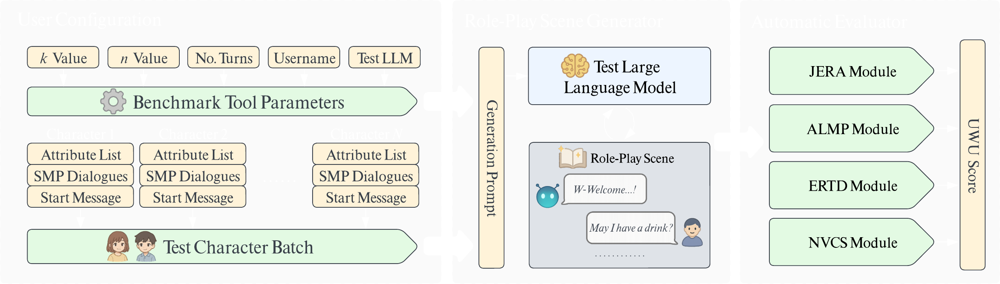

<!-- PROJECT LOGO -->
<br />
<div align="center">
  <a href="https://github.com/Eliolocin/UWU-Benchmarks">
    
  </a>

<h3 align="center">UWU-Benchmarks</h3>

  <p align="center">
    Accessible benchmarking tool for evaluating roleplaying performance of LLMs given k-shot prompts
    <br />
    <a href="https://github.com/Eliolocin/UWU-Benchmarks"><strong>Explore the docs »</strong></a>
    <br />
    <br />
    <a href="https://github.com/Eliolocin/UWU-Benchmarks/issues/new?labels=bug&template=bug-report---.md">Report Bug</a>
    &middot;
    <a href="https://github.com/Eliolocin/UWU-Benchmarks/issues/new?labels=enhancement&template=feature-request---.md">Request Feature</a>
  </p>
</div>



<!-- TABLE OF CONTENTS -->
<details>
  <summary>Table of Contents</summary>
  <ol>
    <li>
      <a href="#about-the-project">About The Project</a>
      <ul>
        <li><a href="#built-with">Built With</a></li>
      </ul>
    </li>
    <li>
      <a href="#getting-started">Getting Started</a>
      <ul>
        <li><a href="#prerequisites">Prerequisites</a></li>
        <li><a href="#installation">Installation</a></li>
        <li><a href="#configuration">Configuration</a></li>
      </ul>
    </li>
    <li><a href="#usage">Usage</a></li>
    <li><a href="#benchmark-algorithms">Benchmark Algorithms</a></li>
    <li><a href="#character-setup">Character Setup</a></li>
    <li><a href="#results">Results</a></li>
    <li><a href="#contributing">Contributing</a></li>
    <li><a href="#license">License</a></li>
    <li><a href="#contact">Contact</a></li>
  </ol>
</details>

<!-- ABOUT THE PROJECT -->
## About The Project

UWU-Benchmarks is a comprehensive evaluation framework designed to assess the roleplay performance of Large Language Models (LLMs). The tool evaluates how well LLMs can maintain character consistency, writing style, and creative storytelling in interactive roleplay scenarios.


<div align="center">
  <em>Default characters used for testing UWU Benchmarks</em>
</div>

### Key Features
* 🎭 **Multi-Algorithm Evaluation**: Uses 4 distinct scoring algorithms (NVCS, ERTD, JERA, ALMP)
* 🤖 **Multi-LLM Support**: Compatible with GPT, Claude, Gemini, and NovelAI models
* 📊 **Comprehensive Scoring**: Combines multiple metrics into a unified UWU score (0-100)
* 🎨 **Character-Based Testing**: Evaluate roleplay performance across diverse character personalities
* 🔧 **Easy Configuration**: Simple INI-based configuration system
* 📝 **Jupyter Integration**: Interactive notebook-based workflow

### Scoring Algorithms
- **NVCS (N-Gram Vector Cosine Similarity)**: Measures writing style similarity using character n-grams
- **ERTD (English Readability Transfer Difference)**: Evaluates readability consistency using Flesch-Kincaid scores
- **JERA (Judgement Evaluation on Roleplay Ability)**: LLM-as-Judge evaluation for immersivity, consistency, and creativity
- **ALMP (Attribute List Match Percentage)**: Assesses how well character attributes are reflected in responses

<p align="right">(<a href="#readme-top">back to top</a>)</p>

### Built With

* [![Python][Python.org]][Python-url]
* [![Jupyter][Jupyter.org]][Jupyter-url]

<p align="right">(<a href="#readme-top">back to top</a>)</p>

<!-- GETTING STARTED -->
## Getting Started

This guide will help you set up UWU-Benchmarks for evaluating LLM roleplay performance.

### Prerequisites

Before running UWU-Benchmarks, ensure you have the following installed:

* **Python 3.8+** - Programming language runtime
  ```sh
  # Check your Python version
  python --version
  ```
* **Jupyter Notebook** - For running the interactive benchmark workflow
  ```sh
  pip install jupyter
  ```

### Installation

1. **Clone the repository**
   ```sh
   git clone https://github.com/Eliolocin/UWU-Benchmarks.git
   cd UWU-Benchmarks
   ```

2. **Install dependencies**
   ```sh
   pip install -r requirements.txt
   ```

3. **Set up character files**
   
   Option A: Use default characters
   ```sh
   # Copy default characters to working directory
   cp -r defaults/characters/plain_text/* characters/
   ```
   
   Option B: Create your own character files (see [Character Setup](#character-setup))

### Configuration

1. **Create configuration file**
   ```sh
   cp config.template.ini config.ini
   ```

2. **Edit config.ini with your settings:**
   ```ini
   [Settings]
   # N-gram size for NVCS Algorithm
   ngram = 3
   # Maximum number of dialogue turns to sample
   smp_dialogues_max = 5
   # Which LLM to benchmark
   test_llm = gpt-4o-mini
   # Number of roleplay turns to generate
   rp_turns = 5
   # Username for roleplay scenarios
   user_name = User

   [APIKeys]
   gpt_key = your_openai_api_key_here
   gemini_key = your_gemini_api_key_here
   claude_key = your_anthropic_api_key_here

   [NAI]
   nai_username = your_novelai_username
   nai_password = your_novelai_password
   ```

<p align="right">(<a href="#readme-top">back to top</a>)</p>

<!-- USAGE EXAMPLES -->
## Usage

### Running the Benchmark

1. **Start Jupyter Notebook**
   ```sh
   jupyter notebook
   ```

2. **Open UWU_Benchmarks.ipynb** in your browser

3. **Execute the notebook cells in order:**
   - **Cell 1**: Load configuration and character data
   - **Cell 2**: Generate roleplay scenes using your chosen LLM
   - **Cell 3**: Evaluate generated content with all benchmark algorithms

<p align="right">(<a href="#readme-top">back to top</a>)</p>

<!-- BENCHMARK ALGORITHMS -->
## Benchmark Algorithms

For detailed mathematical formulations and explanations of how scores are calculated, see [UWU_Algorithms.md](UWU_Algorithms.md) or examine the source code in the `algorithms/` directory.

### NVCS (0-1.0 scale)
Measures writing style consistency between sample dialogues and generated responses using character n-gram analysis.

### ERTD (0-100 scale, lower is better)
Evaluates how well the LLM maintains the readability level of the original character dialogues.

### JERA (0-300 scale)
LLM-as-Judge evaluation across three dimensions:
- **Immersivity** (0-100): Engagement and believability
- **Consistency** (0-100): Character adherence
- **Creativity** (0-100): Uniqueness and dynamism

### ALMP (0-1.0 scale)
Measures how accurately character attributes are reflected in generated roleplay responses.

### UWU Score (0-100 scale)
Composite score combining all algorithms:
- NVCS: 20% weight
- ERTD: 20% weight  
- JERA: 40% weight
- ALMP: 20% weight

<p align="right">(<a href="#readme-top">back to top</a>)</p>

<!-- CHARACTER SETUP -->
## Character Setup

### Using Default Characters

The repository includes pre-made characters in three formats:
```sh
# Copy any format to your characters/ directory
cp defaults/characters/plain_text/* characters/      # Recommended
cp defaults/characters/compressed_attributes/* characters/
cp defaults/characters/structured_object/* characters/
```

### Creating Custom Characters

Create YAML files in the `characters/` directory with this structure:

```yaml
character:
  characterName: "YourCharacterName"
  attributeList: |
    Detailed character description including personality,
    appearance, background, and behavioral traits...

sampleDialogues:
  - "{{user}}: \"Hello there!\""
  - "{{char}}: \"Oh, hello! Nice to meet you!\""
  - "{{user}}: \"How are you today?\""
  - "{{char}}: \"I'm doing wonderfully, thank you for asking!\""

startingMessage: |
  {{char}}: Your character's opening message that sets the scene
  for the roleplay interaction...
```

**Important**: Use `{{user}}` and `{{char}}` placeholders which will be replaced with your configured usernames.

<p align="right">(<a href="#readme-top">back to top</a>)</p>

<!-- RESULTS -->
## Results

### Generated Content
- **Roleplay scenes**: Saved to `generations/` directory as YAML files
- **Contains**: Full conversation logs, metadata, and prompts used

### Benchmark Results
- **Scores**: Saved to `results/` directory as YAML files
- **Includes**: Individual character scores, statistical analysis, and configuration details
- **Metrics**: Average, minimum, maximum, and standard deviation for all algorithms

### Directory Structure After Running
```
UWU-Benchmarks/
├── characters/          # Your character definitions
├── generations/         # Generated roleplay scenes
├── results/            # Benchmark scores and analysis
├── config.ini          # Your configuration
└── ...
```

<p align="right">(<a href="#readme-top">back to top</a>)</p>

<!-- CONTRIBUTING -->
## Contributing

Any contributions you make are **greatly appreciated**.

If you have a suggestion that would make this better, please fork the repo and create a pull request. You can also simply open an issue with the tag "enhancement".

1. Fork the Project
2. Create your Feature Branch (`git checkout -b feature/AmazingFeature`)
3. Commit your Changes (`git commit -m 'Add some AmazingFeature'`)
4. Push to the Branch (`git push origin feature/AmazingFeature`)
5. Open a Pull Request

<p align="right">(<a href="#readme-top">back to top</a>)</p>

<!-- LICENSE -->
## License

Distributed under the MIT License. See `LICENSE` for more information.

<p align="right">(<a href="#readme-top">back to top</a>)</p>

<!-- CONTACT -->
## Contact

Project Link: [https://github.com/Eliolocin/UWU-Benchmarks](https://github.com/Eliolocin/UWU-Benchmarks)

<p align="right">(<a href="#readme-top">back to top</a>)</p>

<!-- MARKDOWN LINKS & IMAGES -->
[Python.org]: https://img.shields.io/badge/Python-3776AB?style=for-the-badge&logo=python&logoColor=white
[Python-url]: https://www.python.org/
[Jupyter.org]: https://img.shields.io/badge/Jupyter-F37626?style=for-the-badge&logo=jupyter&logoColor=white
[Jupyter-url]: https://jupyter.org/
[OpenAI.com]: https://img.shields.io/badge/OpenAI-412991?style=for-the-badge&logo=openai&logoColor=white
[OpenAI-url]: https://openai.com/
[Anthropic.com]: https://img.shields.io/badge/Anthropic-000000?style=for-the-badge&logo=anthropic&logoColor=white
[Anthropic-url]: https://www.anthropic.com/
[Scikit-learn.org]: https://img.shields.io/badge/scikit--learn-F7931E?style=for-the-badge&logo=scikit-learn&logoColor=white
[Scikit-learn-url]: https://scikit-learn.org/